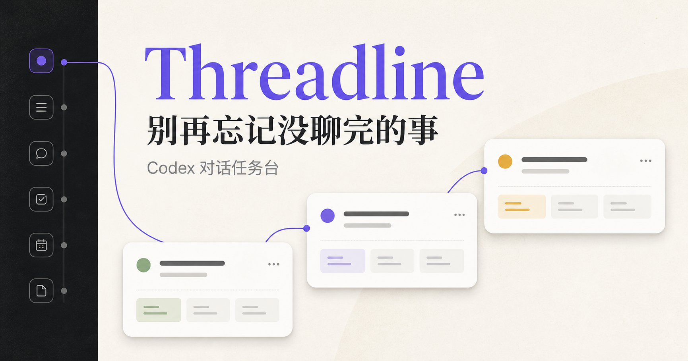

# Threadline AI Inbox

> 把散落在 Codex、ChatGPT 和多台电脑里的 AI 对话，变成一个只需要审批和决策的工作收件箱。

[English summary](#english-summary) · [安装](#本地运行) · [隐私](docs/privacy.md) · [贡献](CONTRIBUTING.md) · [安全问题](SECURITY.md)



Threadline 面向同时处理许多 AI 对话的人。它不会要求你重新阅读所有窗口，而是持续识别哪些任务在运行、哪些在等你拍板、哪些值得继续，以及哪些已经可以结束。

> **项目状态：Alpha。** 这是从真实个人工作流中抽离出的首个社区版本，接口和数据结构仍可能变化。请先使用测试数据，不要直接暴露到公网。

## 为什么做这个项目

当 Codex、ChatGPT 和多台电脑同时工作时，困难往往不是“AI 不够聪明”，而是人无法持续记住几十个对话的状态。Threadline 把这些对话压缩成：

- 最多 3 个今天最值得处理的决定。
- 一个最多约 40 项的活跃工作集。
- 待我处理、AI 处理中、建议继续、等待中和已完成等状态。
- 可搜索、可恢复的历史任务，而不是不可逆删除。

## 当前能力

- Codex 本地任务只读采集与定时同步。
- ChatGPT 网页连接器与历史回填实验功能。
- 多设备、双账号和项目筛选。
- D1 持久化、来源去重和人工状态优先。
- OpenAI-compatible 模型接口，可选 BYOK 智能分类和领导摘要。
- 没有模型密钥时自动退回本地规则判断。
- Windows 优先的安装脚本和 JSON 备份入口。

## 本地运行

需要 Node.js 22.13+。本地开发使用 Cloudflare D1 的模拟环境。

```powershell
git clone https://github.com/SmallHorseBrother/threadline-ai-inbox.git
cd threadline-ai-inbox
npm install
npm run db:local
npm run dev
```

打开终端显示的本地地址。首次访问会写入一组完全虚构的演示任务。

AI 功能是可选的。如果需要启用，将 `.env.example` 复制为 `.dev.vars`，填写自己的 OpenAI-compatible API 配置：

```powershell
Copy-Item .env.example .dev.vars
```

请勿提交 `.dev.vars`、设备配对文件、导出的任务快照或任何真实对话数据。

## 部署说明

当前社区版的首要目标是本地单用户运行。云端版本使用 Cloudflare Workers + D1；部署前需要：

1. 创建自己的 D1 数据库并替换 `wrangler.jsonc` 中的占位数据库 ID。
2. 执行远端迁移。
3. 设置 `THREADLINE_SITE_URL` 和可选的模型环境变量。
4. 使用 Cloudflare Access 保护整个站点。Threadline 会读取 Access 注入的用户邮箱请求头；不要把管理界面裸露在公网。

更详细的说明见 [自托管文档](docs/self-hosting.md)。

## 隐私边界

- Codex 采集器默认读取任务元数据；语义分析只发送有限的首轮和最近对话片段。
- ChatGPT 网页连接器运行在用户浏览器中，需要用户主动安装。
- API 密钥只应保存在部署环境变量中。
- 设备令牌只保存哈希；下载的配对文件仍属于敏感凭据。
- 本仓库只包含虚构演示数据，不包含生产数据库或私人 Git 历史。

完整说明见 [docs/privacy.md](docs/privacy.md)。

## 路线图

- 通用账号管理，不再限制两个固定别名。
- 冷热分层：活跃、候选、资料库和可恢复归档。
- Docker Compose 与 SQLite 单机版。
- 更多 AI 客户端和协作工具连接器。
- 更细的模型成本、数据保留和审计控制。
- 英文界面与无障碍改进。

## 参与贡献

欢迎提交 Issue、讨论和 Pull Request。开始前请阅读 [CONTRIBUTING.md](CONTRIBUTING.md)。安全漏洞请不要公开提交 Issue，处理方式见 [SECURITY.md](SECURITY.md)。

## 许可证

Apache License 2.0。详见 [LICENSE](LICENSE)。

Threadline AI Inbox 是独立社区项目，与 OpenAI、ChatGPT 或 Codex 官方没有隶属或背书关系。

## English summary

Threadline AI Inbox turns scattered Codex and ChatGPT conversations into a decision-focused work inbox. It highlights tasks that need your input, agents that are still running, stalled work worth resuming, and conversations that can be safely closed.

The first community release is an alpha focused on local, single-user use with Cloudflare D1 emulation. Optional AI classification works with OpenAI-compatible APIs and BYOK credentials. See the Chinese sections above for setup, privacy boundaries, and the roadmap.
