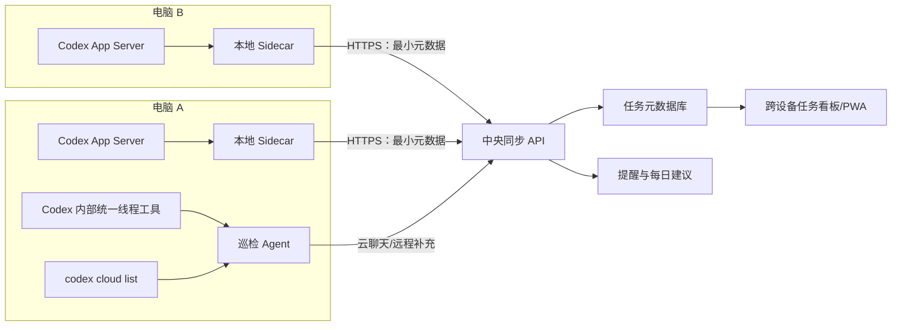

# Codex 对话总任务台：跨设备与对话接入架构

结论：推荐采用“每台设备本地采集 + 中央最小元数据任务库 + Codex 内置跨来源巡检”三层混合架构。第一阶段可立即依赖当前桌面应用内部的统一线程工具建立可用看板；第二阶段在每台电脑运行只读 sidecar，通过 `codex app-server` 可靠采集该机的 CLI/IDE/本地线程；云端 Codex task 另用 `codex cloud list --json` 接入。中央库默认不保存完整对话，只保存任务状态、短摘要、时间、来源定位符与分类证据。

这条路线兼顾覆盖面和可维护性：Codex 桌面应用内部工具能看到本机、已连接远程主机和已登录聊天历史，但它不是对普通 Web 应用公开的稳定 HTTP API；App Server 有明确 JSON-RPC 协议，适合自建采集器，但它只代表运行它的那台主机，且当前仍标为 experimental。两者结合，能先上线、再逐步减少对隐式能力的依赖。

## 1. 当前环境实测能力

本机实测为 `codex-cli 0.146.1`。以下结论来自本机 CLI、该版本生成的 JSON Schema、当前 Codex 桌面会话暴露的 callable tools，以及 2026-09-08 刷新的官方 Codex Manual。

### 1.1 桌面应用内部的统一线程工具

当前会话可调用：

- `codex_app__list_threads({ limit })`：列出桌面应用中的近期线程；工具契约明确覆盖本地主机、已连接远程主机和已登录的 chat history，并返回 backing kind。
- `codex_app__read_thread({ threadId, hostId?, turnLimit?, cursor?, includeOutputs? })`：不打开对话即可读取状态和近期 turn 摘要。
- `codex_app__wait_threads({ targets, timeoutMs })`：等待最多 8 个 Codex thread 完成或需要关注，适合活动监控，不适合作为全量同步分页器。
- `codex_app__set_thread_pinned`、`codex_app__set_thread_archived`、`codex_app__set_thread_title`：回写 Codex 原生组织状态。
- `codex_app__send_message_to_thread`：向现有 thread/chat 发送后续消息。
- `codex_app__handoff_thread`：在匹配的已保存项目主机之间转移 thread 和 Git 状态；不支持云端 handoff。
- `codex_app__list_projects`：列出本地、远程与 ChatGPT project。
- `codex_app__automation_update`：创建/更新 thread heartbeat 或 standalone cron automation。

重要边界：这些是 Codex 应用给 agent 的内部能力。它们适合让“巡检 agent”收集和整理任务，但不能假设浏览器中的普通前端、Node 服务或第三方客户端可以直接调用。当前实测 `list_threads` 调用还出现过超时，因此实现必须支持超时、部分成功和下次重试，不应把它设计成 UI 每次刷新都同步阻塞调用的后端。

### 1.2 Codex App Server

本机 CLI 提供：

```powershell
codex app-server --help
codex app-server generate-json-schema --experimental --out <dir>
codex app-server daemon bootstrap
codex app-server daemon start
codex app-server daemon version
```

App Server 使用省略 wire-level `jsonrpc` 字段的 JSON-RPC 2.0。默认 `stdio://` 是逐行 JSON；也支持 WebSocket 和 Unix socket。WebSocket transport 官方仍标为 experimental/unsupported，不应直接暴露公网。

任务台相关的 v2 方法：

| 方法/事件 | 用途 |
|---|---|
| `initialize` + `initialized` | 建立会话；实验字段需声明 `capabilities.experimentalApi=true` |
| `thread/list` | cursor 分页；支持 `created_at`、`updated_at`、`recency_at` 排序及 `archived`、`isPinned`、`cwd`、`sourceKinds`、`searchTerm` 等过滤 |
| `thread/read` | 只读 thread；`includeTurns=false` 只取摘要，不把线程载入内存 |
| `thread/turns/list` | 实验接口；分页读取 turn，`itemsView=summary` 是任务分类的优先选择 |
| `thread/items/list` | 实验接口；更细粒度 item 分页，只在确需语义分类时使用 |
| `thread/goal/get` | 读取持久 goal，状态为 `active/paused/blocked/usageLimited/budgetLimited/complete` |
| `thread/metadata/update` | 更新 `isPinned` 和 Git 元数据；不能承载自定义看板字段 |
| `thread/archive` / `thread/unarchive` | 原生归档/恢复；`thread/delete` 是永久删除，任务台绝不自动调用 |
| `thread/status/changed` | 运行状态变化 |
| `turn/started` / `turn/completed` | turn 生命周期；完成状态为 `completed/interrupted/failed` |
| `turn/plan/updated` | 获取计划项 `pending/inProgress/completed`，可作为“建议继续”的证据 |

`Thread` 摘要对象在本机 schema 中至少包含 `id/sessionId/name/preview/cwd/source/threadSource/modelProvider/createdAt/updatedAt/recencyAt/isPinned/status/gitInfo` 等字段。运行状态只表达执行状态：

- `notLoaded`
- `idle`
- `systemError`
- `active`，可附 `waitingOnApproval` 或 `waitingOnUserInput`

因此不能把 `idle` 等同于“已完成”。业务完成状态必须来自 goal、归档、用户手工选择或对近期对话的语义判断。

建议的 sidecar 握手与增量拉取：

```json
{"method":"initialize","id":0,"params":{"clientInfo":{"name":"codex-taskboard-agent","title":"Codex Taskboard Agent","version":"0.1.0"},"capabilities":{"experimentalApi":true}}}
{"method":"initialized","params":{}}
{"method":"thread/list","id":1,"params":{"limit":100,"sortKey":"recency_at","sortDirection":"desc","archived":false,"sourceKinds":["cli","vscode","appServer"]}}
{"method":"thread/read","id":2,"params":{"threadId":"<opaque-id>","includeTurns":false}}
{"method":"thread/turns/list","id":3,"params":{"threadId":"<opaque-id>","limit":3,"sortDirection":"desc","itemsView":"summary"}}
{"method":"thread/goal/get","id":4,"params":{"threadId":"<opaque-id>"}}
```

每次升级 Codex CLI 后都运行 schema 生成命令，并用生成物做契约测试；不要把 0.146.1 的字段视为永久 ABI。

### 1.3 本地持久化数据

当前机器可见：

- `$CODEX_HOME/sessions/YYYY/MM/DD/*.jsonl`：本地 active thread rollout；本机约有数百个文件。
- `$CODEX_HOME/archived_sessions/`：已归档 rollout。
- `$CODEX_HOME/state_5.sqlite`：thread 索引。实测 `threads` 表含 id、rollout_path、created/updated/recency、source、cwd、title/preview/name、archived、is_pinned、git 信息等。
- `$CODEX_HOME/goals_1.sqlite`：`thread_goals`，含 objective、goal status、token budget/usage、时间使用等。
- `$CODEX_HOME/session_index.jsonl`：本地索引兼容数据。

这些文件证明 App Server 的数据基础，但不是推荐的集成 API。版本后缀（如 `state_5`）、表结构和 rollout schema 都可能迁移；数据库处于 WAL 并发写入状态。任务台只应通过 App Server 读取。仅在 App Server 完全不可用时，才可做只读离线快照：复制数据库及 `-wal`/`-shm` 到临时目录后读取，绝不直接写库。

严禁同步或上传整个 `$CODEX_HOME`。其中还包含 `auth.json`、插件 OAuth、浏览器状态、附件、日志、Computer Use 资料等高敏感内容。

### 1.4 Codex Cloud task

本机 CLI 另有：

```powershell
codex cloud list --json --limit 20 --cursor <cursor>
codex cloud status <TASK_ID>
```

实测 JSON 顶层为 `tasks,cursor`，task 字段含 `id,url,title,status,updated_at,environment_id,environment_label,summary,is_review,attempt_total`。这适合接入 Codex Cloud task，但不等价于 ChatGPT/Codex 的所有云端聊天历史。

目前没有可安全假设存在的公共“列出任意 ChatGPT 个人对话历史”API。云端聊天覆盖应优先使用 Codex 桌面 agent 内部的 `list_threads/read_thread` 能力；若该能力不可用，任务台要明确显示“该来源暂不可扫描”，而不是抓取网页、读取浏览器数据库或伪造同步完成。

### 1.5 跨设备真实边界

Codex Remote 让另一台已授权设备连接原 host，继续原 host 的 projects/chats/files/credentials/plugins/tools。它是远程访问，不是把本地 thread rollout 复制到每台电脑。原 host 睡眠、断网或关闭桌面应用后，remote access 停止。

Handoff 会把现有 chat 与 Git state 转移到匹配的另一 host worktree；适用于真正迁移执行位置，但不是通用历史同步，也不支持 handoff 到 Codex cloud。

ChatGPT/ChatGPT Work 云端 chat 和 Codex Cloud task 由账号侧可见；本地 Codex/CLI/IDE thread 保留在创建它的 host。Web scheduled task 不能直接访问电脑文件；桌面端本地 scheduled task 需要目标机器开机且应用运行。

## 2. 三种同步方案

### 方案 A：纯 Codex 应用内任务台

由一个常驻“总任务台”Codex thread 使用 `codex_app__list_threads` 扫描本机、remote host 与 signed-in chat history；按需 `read_thread` 读取最近若干 turn，生成统一任务 JSON/Markdown；用 thread heartbeat 每 15～30 分钟巡检并提醒；用 pin/archive/title 回写 Codex 原生状态。

优点：最快上线；覆盖桌面应用当前能看到的多来源；沿用用户账号与 Remote 权限；无需暴露 daemon 或保存新凭据。

缺点：能力只在 Codex agent 内可调用；没有面向普通前端的公开 SLA/分页契约；scan 可能超时；桌面 host 离线时本地来源不可见；看板 UI 需要由 agent 输出或另行发布快照。

适合：第一阶段 MVP、个人使用、验证状态规则。

### 方案 B：每台 host 的 App Server sidecar + 中央元数据库

每台电脑运行一个本地采集器。采集器通过子进程启动 `codex app-server` 并用 stdio JSONL 通信；初次全量 `thread/list`，以后用 `recency_at` + cursor 增量轮询，并监听 `thread/status/changed`、`turn/completed`、archive/unarchive 事件。采集器只向中央 HTTPS 服务“出站推送”规范化元数据。PWA/桌面板只读中央 API，因此任意设备都能查看。

优点：接口明确、可测试、实时性高；不要求中央服务器连入家庭/办公电脑；可完全不上传 transcript；适合真正的跨设备看板。

缺点：每台电脑都要安装和运行 sidecar；App Server/实验 turn pagination 可能变化；只覆盖各 host 的 Codex 本地存储，不天然覆盖所有 ChatGPT cloud chats；host 离线时数据变旧。

适合：正式个人系统、长期运行、需要 PWA 与可靠状态的场景。

### 方案 C：每台 host 导出脱敏 manifest 到同步盘/Git 私库

每台电脑定时生成 `task-manifest.<host-id>.json`，只含 thread id、标题、短摘要、状态、时间、哈希后的 cwd 与来源，不含消息正文。通过 OneDrive/iCloud/Dropbox/Git 私库同步；任一设备上的任务台合并多个 manifest。

优点：无自建后端；容易审计；失败时仍有静态快照；几乎没有入站网络攻击面。

缺点：刷新延迟；多端手工状态会冲突；删除/归档 tombstone 难处理；同步盘可能产生冲突副本；仍需每台 host 有导出器；云端聊天覆盖不足。

适合：离线优先、个人低成本备选与灾备导出。

### 方案 D：直接同步 `$CODEX_HOME` / 直接读写 SQLite

不推荐。它看似最省事，实则会同步身份凭据和完整敏感历史，且 JSONL、WAL、版本化 SQLite 在多机并发下容易损坏或出现不可解释冲突。只保留为“只读离线导入旧机器”的恢复工具，永不双向写回。

## 3. 推荐混合方案

采用 A + B，并保留 C 作为备份：

1. **立即可用层**：Codex 内部巡检 agent 定期调用统一 `list_threads/read_thread`，补足 cloud chat 和 remote host 的覆盖；结果写入中央任务库或导出 manifest。
2. **可靠本地层**：每台电脑 sidecar 用 App Server 采集自己的本地线程，事件驱动更新，5～15 分钟轮询兜底。
3. **云任务层**：always-on host 运行 `codex cloud list --json`；把 Cloud task 作为单独 provider 接入。
4. **展示层**：PWA/桌面页面只访问中央任务 API，支持离线缓存；任何机器只需登录同一任务台账号即可查看。
5. **回写层**：任务台自己的 status 默认只写中央库。只有用户明确动作才映射到 Codex pin/archive；不自动发消息、不自动完成 goal、不调用 delete。

推荐把一台稳定在线的 Windows/Mac 作为“主巡检 host”，开启 Codex Remote。这台机器负责应用内聚合和云 task 扫描；其他电脑只运行本地 sidecar。即便主机离线，中央看板仍显示最后快照并标记 stale，不谎报已同步。



## 4. 规范化数据模型

运行状态、业务状态和同步状态必须分表/分字段，避免互相覆盖。

```ts
type Provider = "codex_local" | "codex_remote" | "chatgpt_cloud" | "codex_cloud";

type BoardStatus =
  | "inbox"
  | "in_progress"
  | "waiting_me"
  | "waiting_external"
  | "suggested_next"
  | "blocked"
  | "snoozed"
  | "done";

type RuntimeStatus =
  | "unknown"
  | "not_loaded"
  | "idle"
  | "active"
  | "needs_approval"
  | "needs_user_input"
  | "failed";

interface Task {
  taskId: string;                 // 任务台 UUID；不直接使用 native id
  title: string;
  boardStatus: BoardStatus;
  runtimeStatus: RuntimeStatus;
  priority: 0 | 1 | 2 | 3;
  summary?: string;               // 脱敏、建议 <= 280 字
  suggestedAction?: string;
  manualOverride: boolean;        // 人工状态优先于分类器
  classifierVersion?: string;
  confidence?: number;
  evidenceCodes: string[];        // 仅原因码，不存原文
  createdAt: string;
  lastActivityAt: string;
  completedAt?: string;
  snoozedUntil?: string;
  nextReviewAt?: string;
  lastScannedAt: string;
  sourceFreshUntil?: string;
  version: number;                // 乐观锁
}

interface ThreadRef {
  refId: string;
  taskId: string;
  provider: Provider;
  accountWorkspaceKey: string;    // workspace/account 的不可逆稳定哈希
  hostInstallationKey?: string;   // installation id 的哈希
  nativeThreadId: string;         // opaque；不可解析或重写
  nativeSessionId?: string;       // fork/handoff/lineage 去重辅助
  currentHostId?: string;
  sourceKind?: string;
  nativeUrl?: string;             // 仅 Cloud CLI 明确返回 URL 时保存
  cwdHash?: string;
  gitOriginHash?: string;
  gitBranch?: string;
  isPinned?: boolean;
  isArchived?: boolean;
  sourceUpdatedAt?: string;
  sourceRevision?: string;
  lastSeenAt: string;
  tombstonedAt?: string;
}
```

身份键建议为 `(provider, accountWorkspaceKey, nativeThreadId)`；host 是可变化属性，而非主键，因为 handoff 会改变执行主机。若两个来源最终确认是同一个对话，用 `ThreadRef` 多对一挂到同一 `Task`，不要重写 native id。

此外应保存：

- `SourceCheckpoint(provider, host, cursor, lastSuccessAt, errorCode, consecutiveFailures)`
- `TaskStatusEvent(taskId, from, to, actor, reason, occurredAt)`
- `Notification(taskId, kind, scheduledAt, sentAt, dedupeKey)`
- `SourceAlias(oldRef, newRef, relation=handoff|fork|import)`

## 5. 状态推导规则

按以下优先级，第一条命中即停止：

1. 人工 `manualOverride`，含 snooze/done/reopen。
2. 原生 goal：`complete -> done`；`blocked/usageLimited/budgetLimited -> blocked`；`active -> in_progress`；`paused -> snoozed`（但要保存原始 goal 状态）。
3. runtime：`waitingOnUserInput` 或 `waitingOnApproval -> waiting_me`；active/inProgress -> in_progress；systemError/最近 turn failed -> blocked。
4. 已归档且无人工 reopen -> done；归档只是完成证据，不删除任务。
5. idle/notLoaded 必须进入语义分类，不直接判完成：只读取最近 1～3 个 turn 的 summary，识别未回答问题、承诺的后续动作、未完成 plan、明确完成语句。
6. 高置信度未完成且 24 小时无活动 -> suggested_next；信息不足 -> inbox。

建议 evidence code：`GOAL_COMPLETE`、`WAITING_USER_INPUT`、`WAITING_APPROVAL`、`LAST_TURN_FAILED`、`PLAN_HAS_PENDING`、`ASSISTANT_PROPOSED_NEXT_STEP`、`USER_PROMISE_UNFULFILLED`、`ARCHIVED_BY_USER`、`STALE_SOURCE`。

“建议继续推进”不要仅靠时间。至少需要一个内容证据（pending plan、明确待办、未回答问题）加一个时间阈值。提醒去重键可用 `taskId + evidenceHash + localDate`，避免多设备重复通知。

## 6. 中央同步 API 建议

采用设备向外推送，中央服务器不主动连接用户电脑。

```http
POST /v1/device-enrollments
POST /v1/sources/{sourceId}/snapshots
POST /v1/sources/{sourceId}/events:batch
GET  /v1/tasks?status=&cursor=&updated_after=
GET  /v1/changes?after=<opaque-cursor>
PATCH /v1/tasks/{taskId}  If-Match: <version>
POST /v1/tasks/{taskId}/actions/pin
POST /v1/tasks/{taskId}/actions/archive
```

`snapshots` 支持 upsert + tombstone，body 带 `scanId,startedAt,completedAt,nextCursor,records[]`。服务端按 `sourceRevision` 幂等；只有完整分页成功后才将“本次未出现”的旧记录标记候选 tombstone，不能因一次超时误删。

冲突规则：

- 手工状态 > 自动分类。
- 同一手工字段使用 version/ETag 乐观锁；冲突返回 409 和最新对象。
- 来源字段按 source timestamp + 单调 revision 合并。
- 本地 thread 未见不等于删除；连续 3 次完整 scan 未见或收到明确 archive/delete event 才 tombstone。
- sidecar 与巡检 agent 同时上报同一 native thread 时，以更直接来源的数据为主：本机 App Server > remote 聚合副本；但 cloud-only 字段保留。

## 7. 安全与隐私

- 默认只在 host 内运行语义分类，中央保存短摘要和 evidence code；完整 turn 不离开电脑。
- UI 默认隐藏 cwd、仓库 URL、分支和 thread id；需要时按权限展开。
- 设备注册使用每设备密钥，支持撤销；传输只用 TLS；中央库静态加密。
- App Server 优先由 sidecar 作为子进程以 stdio 使用。若必须 WebSocket，只监听 `127.0.0.1` 或 SSH tunnel；非 loopback 必须 `wss` 和 bearer auth。token 放文件/系统凭据库，不进命令行、日志或同步 manifest。
- 不读取、不上传 `auth.json`、OAuth token、浏览器 profile、附件、Computer Use 录像/截图或原始工具输出。
- 把 thread title/preview/message 当作不可信数据；它们只能作为显示文本或分类输入，绝不能被解释为 sidecar 命令。
- 所有回写操作要有 allowlist。自动允许 `pin/unpin` 可选；`archive` 建议明确点击后执行；永不自动 `delete`、`send_message` 或启动 turn。
- WebSocket app-server 当前为实验能力。生产运行应 pin CLI 版本、生成 schema、做兼容性测试、提供 kill switch 和回退到轮询/manifest。

## 8. 失败与可观测性

每个来源在看板显示：`lastSuccessAt`、数据年龄、host online/offline、最近错误与“部分同步”标识。建议阈值：

- 15 分钟内：fresh
- 15 分钟～24 小时：stale，仍展示最后快照
- 超过 24 小时：offline/unknown，不进行新的“已完成”自动判断

sidecar 采用指数退避 + jitter；App Server WebSocket ingress 出现 `-32001 Server overloaded` 时重试。全量 scan、增量 scan、分类、通知分别统计成功率和延迟，避免一个分类器错误污染采集健康度。

## 9. 分阶段实施建议

### Phase 0：本机只读 MVP（当天）

- 使用当前应用内 `list_threads/read_thread` 生成统一任务列表。
- 实现 BoardStatus、manual override、stale 标识和去重提醒。
- 保留 provider/host/native id，避免先用标题做身份键。

### Phase 1：多主机 sidecar（1～2 天）

- stdio 启动 App Server；实现 initialize、thread/list、thread/read、goal/get。
- 只上传 metadata；用 cursor 和 `recency_at` 增量同步。
- 每台 host 显示独立 freshness。

### Phase 2：实时事件与云 task（1 天）

- 订阅 status、turn completed、archive/unarchive。
- 增加 `codex cloud list --json` adapter。
- 对桌面内部统一 scan 做定时补偿，覆盖 cloud chat 和 remote host。

### Phase 3：安全回写与提醒（1 天）

- 支持用户点击 pin/archive/reopen；保留审计事件。
- 仅当证据变化或到达 nextReviewAt 时提醒。
- 每日给出最多 3 个“建议继续”，另列 waiting_me 和 blocked。

## 10. 风险清单与决策

| 风险 | 影响 | 缓解 |
|---|---|---|
| App Server/分页字段仍属 experimental | 升级后采集失败 | pin 版本、每次生成 schema、契约测试、manifest fallback |
| 桌面内部跨来源工具无公共 SLA | 云聊天扫描超时或字段变化 | 后台异步、部分成功、缓存、显式 source health |
| Host 离线 | 本地对话无法更新 | 中央保存最后快照并标 stale；部署 always-on 主巡检 host |
| `idle` 被误判完成 | 丢失待办 | 运行状态与业务状态分离；goal/人工/语义证据优先 |
| 多设备重复/冲突 | 重复卡片、重复提醒 | opaque identity、lineage alias、ETag、通知 dedupe |
| 同步原始历史泄露 | 高隐私风险 | host-side 分类、最小元数据、禁止同步 `$CODEX_HOME` |
| 自动 archive/send 误操作 | 难恢复或产生外部影响 | 默认只读；回写需明确用户动作；永不自动 delete/send |
| Handoff 后 host 改变 | 卡片重复 | host 非主键；用 native id/session lineage 合并 |

最终决策：**实现混合方案 A+B，方案 C 作为只读灾备；明确拒绝方案 D。** 若只能先做一个版本，则先做 A 的异步快照看板，但数据层从第一天就采用上述多 provider 模型，以便无迁移接入 sidecar。

## 官方依据

- [Codex App Server](https://learn.chatgpt.com/docs/app-server.md)
- [Remote connections](https://learn.chatgpt.com/docs/remote-connections.md)
- [Projects and chats](https://learn.chatgpt.com/docs/projects.md)
- [Scheduled tasks](https://learn.chatgpt.com/docs/automations.md)
- [Codex App Server open-source implementation](https://github.com/openai/codex/tree/main/codex-rs/app-server)
