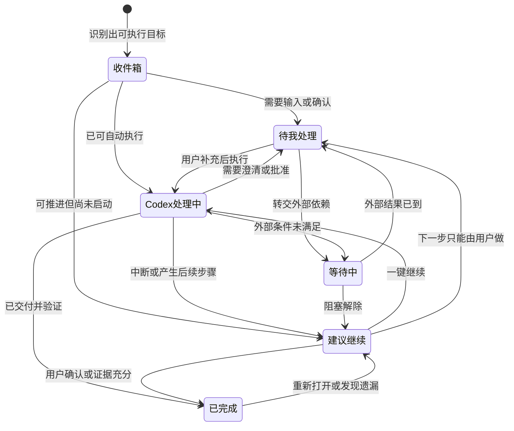

# Codex 对话任务看板：产品逻辑与中文 UX 规格

## 1. 产品定位

“Codex 对话任务看板”不是聊天记录列表，而是把分散在不同设备、不同项目和不同时间里的 Codex 对话，自动转化为一组可管理、可继续、可提醒的任务卡。

核心承诺只有三件事：

1. 用户一眼知道还有什么没做完。
2. 用户一键回到最值得继续的对话和上下文。
3. 系统主动提醒，但不因误判“已完成”而让任务消失。

产品默认以 Codex 账号为同步主体，以 `conversation_id` 为跨设备稳定标识。设备只记录任务最近在哪台机器推进、该机器是否在线，以及任务是否依赖该机器上的本地工作区。

## 2. 核心对象与数据模型

### 2.1 任务卡

每个可执行的 Codex 对话对应一张任务卡。纯问答、闲聊、已明确结束且无后续动作的对话可以不进入看板，但仍可在“全部对话”中找到。

建议字段：

| 字段 | 含义 |
|---|---|
| `task_id` | 看板任务唯一标识 |
| `conversation_id` | Codex 对话唯一标识 |
| `title` | 自动生成、用户可编辑的任务标题 |
| `summary` | 一句话说明目标与当前进展 |
| `status` | 当前主状态 |
| `substatus` | 解释为什么处于当前状态 |
| `completion_confidence` | 系统判断完成的置信度，0–1 |
| `next_action` | 下一步最小可执行动作 |
| `next_actor` | 下一步由用户、Codex、外部人员或外部系统执行 |
| `suggestion_score` | 建议继续推进分，0–100 |
| `priority` | 用户设置的高、中、低优先级；默认中 |
| `due_at` | 截止时间，可为空 |
| `snoozed_until` | 暂不提醒到何时 |
| `last_activity_at` | 最后一次有效推进时间 |
| `last_user_message_at` | 用户最后发言时间 |
| `last_codex_message_at` | Codex 最后发言时间 |
| `blocked_reason` | 阻塞原因 |
| `workspace_ref` | 关联项目、工作区或 Git 仓库 |
| `host_affinity` | 最近使用设备及本地依赖 |
| `artifacts` | 交付物、文件、PR、链接 |
| `source_tags` | 自动标签：编码、研究、写作、运维等 |
| `manual_override` | 用户是否手动锁定状态或优先级 |
| `sync_revision` | 跨端同步版本号 |

### 2.2 有效推进事件

更新时间不等于有推进。以下事件才更新 `last_activity_at`：

- 用户补充了可执行信息或做出关键选择；
- Codex 完成了一个实质步骤、写入文件、提交结果或获得新证据；
- 任务状态、截止时间、下一步、阻塞原因发生变化；
- 外部依赖有结果返回；
- 用户明确标记完成、恢复或搁置。

仅打开对话、滚动、点赞、查看通知不算推进。

## 3. 状态模型

主状态应少而稳定，详细原因放进子状态。推荐六个主状态：

| 主状态 | 对用户的含义 | 常见子状态 | 默认是否提醒 |
|---|---|---|---|
| 收件箱 | 新识别出的任务，尚未确认 | 新任务、疑似任务 | 温和提醒 |
| 待我处理 | 下一步需要用户输入或行动 | 待确认、待补资料、待审批、待执行 | 是 |
| Codex 处理中 | Codex 正在运行或已经排队 | 运行中、排队中、定时执行中 | 仅异常提醒 |
| 等待中 | 当前被外部条件阻塞 | 等同事、等服务、等设备、等日期 | 到点或状态变化提醒 |
| 建议继续 | 当前可继续，且值得推进 | 停滞、接近完成、高价值、临近截止 | 是 |
| 已完成 | 已满足目标，不再需要动作 | 已交付、已验证、用户关闭 | 否 |

另设两个非主状态控制：

- **稍后再说**：本质是带恢复时间的休眠，不应作为永久列。到期后回到原状态。
- **已归档**：只控制是否出现在默认看板，不改变“已完成/未完成”的语义；未完成任务也可以被归档，但需明确提示“归档不会完成任务”。

### 3.1 状态迁移规则



状态同步采用“服务器版本优先 + 用户手动操作优先于模型推断”的原则：

- 用户手动设置的状态在所有设备立即同步；
- 模型不得覆盖仍有效的手动锁定，除非用户点“恢复自动管理”；
- 两台设备同时编辑时，字段级合并；同一字段冲突则保留最新人工操作；
- 正在某设备运行的任务可以在其他设备查看，但涉及本地环境时显示“需回到设备：办公电脑”；
- 设备离线不是任务状态，只是一个运行条件。

## 4. 任务识别与完成判断

### 4.1 何时创建任务卡

满足任一条件则创建：

- 用户使用明确动词要求产出、修改、研究、监控、提醒或决策；
- 对话产生了文件、代码变更、计划、待办、审批或等待事项；
- Codex 明确表示仍有后续步骤、存在阻塞或需要用户回复；
- 用户手动“加入任务板”。

以下情况默认不创建：

- 单一事实问答，回答后没有后续动作；
- 纯闲聊；
- 用户明确说“只是问问”“不用继续”；
- 重复对话已被归并到同一任务。

系统不确定时进入“收件箱”，用轻量文案：`看起来这可能是一项任务，已放入收件箱。` 不弹模态框打断用户。

### 4.2 完成判断的证据层级

“最后一条消息已回答”不等于“任务已完成”。完成判断分四级证据：

1. **强人工证据**：用户点击“完成”，或说“完成了/可以结束/不用继续”。
2. **强系统证据**：目标交付物已生成，必要验证通过，且不存在未解决的下一步、错误、阻塞或待确认。
3. **中等系统证据**：Codex 声称完成并给出成果，但缺少验证或仍有可选后续动作。
4. **弱语义证据**：对话自然停止、用户回复“好/谢谢”、长时间未互动。弱证据永远不能自动完成任务。

建议置信度计算：

```text
completion_confidence = clamp(
  0.55 × goal_coverage
  + 0.20 × artifact_evidence
  + 0.15 × verification_evidence
  + 0.10 × explicit_closure
  - 0.35 × unresolved_required_steps
  - 0.25 × active_blockers
  - 0.20 × pending_user_decision,
  0, 1
)
```

其中：

- `goal_coverage`：原始请求中必要目标的覆盖率；
- `artifact_evidence`：交付物是否存在、能否访问；
- `verification_evidence`：测试、预览、检查或外部确认是否通过；
- `explicit_closure`：用户明确结束为 1，Codex 明确交付为 0.5，否则 0；
- 各扣分项采用 0–1 强度。

处理阈值：

| 置信度 | 动作 |
|---|---|
| `≥ 0.90` 且无未解决必要步骤 | 自动移至“已完成”，提供 7 天可撤销入口 |
| `0.70–0.89` | 保持原状态，展示“可能已完成”按钮 |
| `< 0.70` | 不提示完成，继续根据下一执行者归类 |

安全阀：

- 有待审批、待用户决定、失败测试、未提交文件或明确 TODO 时，禁止自动完成；
- 仅因超过若干天没有消息，禁止自动完成；
- “可选优化”不阻止完成，但应以“后续建议”保留；
- 任务被自动完成后，如 7 天内出现新消息或交付物验证失败，自动恢复到“建议继续”；
- 用户连续两次纠正某类自动判断后，下调该用户/任务类型的自动完成权重。

### 4.3 下一步与下一执行者

每次有效推进后，抽取一个“最小下一步”，格式必须为动词开头、可在一次会话或一个现实动作中完成。例如：

- `确认首页采用深色还是浅色主题`
- `在办公电脑运行集成测试`
- `等待设计同事回复 Figma 链接`
- `让 Codex 修复剩余 2 个测试失败`

禁止使用空洞下一步，如“继续推进”“进一步优化”。若无法明确抽取，下一步显示：`回看最后进展并决定下一步`。

## 5. “建议继续推进”评分算法

评分每次状态变化后重算，后台每天至少重算一次。目标不是预测“最重要”，而是给出可解释、可调节的继续顺序。

### 5.1 评分公式

```text
suggestion_score = clamp(
  22 × priority
  + 20 × urgency
  + 16 × readiness
  + 14 × near_completion
  + 10 × user_momentum
  + 10 × staleness_need
  + 8  × impact
  - 18 × blocker_strength
  - 12 × reminder_fatigue,
  0, 100
)
```

所有子项归一化为 0–1：

- `priority`：用户高/中/低分别为 1/0.55/0.2；未设置默认为 0.55。
- `urgency`：有截止时间时采用分段衰减；逾期为 1，24 小时内 0.9，3 天内 0.7，7 天内 0.45，无截止时间为 0.2。
- `readiness`：所需输入、设备和权限都具备为 1；需用户补一个选择为 0.6；明确等待外部依赖为 0。
- `near_completion`：按剩余必要步骤估算；一步可完成为 1，二到三步 0.7，更多为 0.3。
- `user_momentum`：近 24 小时有推进为 1，3 天内 0.7，7 天内 0.35，之后为 0.1。
- `staleness_need`：避免任务被遗忘；3 天 0.2，7 天 0.5，14 天 0.8，30 天 1。对于用户主动搁置的任务为 0。
- `impact`：基于用户标记、是否阻塞其他任务、是否有明确交付价值；不可仅凭对话长度判断。
- `blocker_strength`：硬阻塞为 1，软阻塞为 0.4，无阻塞为 0。
- `reminder_fatigue`：7 天内每次忽略提醒累加 0.2，最高 1；用户主动打开任务后归零。

### 5.2 入选规则

- 分数 `≥ 70`：进入“今天建议继续”，最多 3 项；
- `50–69`：进入“建议继续”列，但不主动推送；
- `< 50`：保留在原状态，可在全部任务查看；
- “待我处理”中临近截止或逾期任务，无论分数都进入顶部；
- “等待中”不得因为陈旧度升高而高频提醒，只在等待期限到达或外部状态变化时提醒；
- 三项推荐应尽量多样：同一项目默认最多 2 项，同一类型默认最多 2 项；
- 当分数接近时，优先选择能在 15 分钟内形成明确推进的任务；
- 每张推荐卡必须展示最多两个可解释理由，例如：`明天到期 · 只差一步`，不向用户展示复杂公式。

### 5.3 用户反馈校准

卡片菜单提供：

- `更常提醒这类任务`
- `少提醒这类任务`
- `这不是任务`
- `这个任务已完成`
- `稍后提醒`

反馈作用于个人化权重，但不改变全局状态定义。模型应记录用户更看重的项目、常用工作时段和可接受提醒频率，不根据敏感属性推断优先级。

## 6. 提醒策略

### 6.1 提醒分层

| 层级 | 触发条件 | 载体 | 默认频率 |
|---|---|---|---|
| 即时 | Codex 需要用户输入、运行失败、审批即将过期 | 应用内 + 可选系统通知 | 每个状态变化一次 |
| 今日摘要 | 今日建议继续、逾期、等待条件已解除 | 应用内任务中心 + 系统摘要 | 每天一次 |
| 回顾 | 长期停滞、收件箱未整理、疑似已完成 | 周回顾 | 每周一次 |
| 静默标记 | 普通分数变化、低优先级更新 | 角标和列表排序 | 不推送 |

### 6.2 默认节奏

- 每日首次打开 Codex 时显示“今日任务”摘要，不强制弹窗；
- 若用户当天未打开，可在本地时间 10:00 发送一条合并通知；
- 工作日 17:30 提供可选的“收尾提醒”，只包含待用户处理或接近完成的任务；
- 周一显示“本周值得推进”，周五显示“本周未收尾”；
- 22:00–08:00 为默认免打扰，逾期也不突破，除非用户显式开启紧急提醒；
- 跨时区以用户当前设备时区为准，服务端避免同一天重复发送；
- 同一任务 24 小时最多主动提醒一次，状态未变化不得重复相同文案；
- 连续两次忽略后降低频率，并提供“暂停这类提醒”。

### 6.3 提醒文案

强调下一步和理由，不制造压力。

推荐：

- `还有 2 项在等你决定，其中 1 项明天到期。`
- `“客户数据导入”只差一次验证，预计 10 分钟可收尾。`
- `设计反馈已经到了，可以继续“移动端首页”。`
- `你有 4 个任务两周未推进。要不要先看最容易完成的 2 个？`

避免：

- `你还有很多事情没做！`
- `立即完成这些任务。`
- `Codex 判断你没有效率。`

通知操作按钮最多三个：`继续`、`稍后`、`标记完成`。高风险或需要本地设备的任务，“继续”先展示条件，不假装可在当前设备直接执行。

## 7. 卡片信息架构

### 7.1 卡片正面信息优先级

从高到低：

1. 任务标题；
2. 当前状态与下一步；
3. 为什么现在值得关注；
4. 最近推进时间；
5. 项目/工作区与设备依赖；
6. 截止时间、优先级、交付物数量；
7. 快捷操作。

标准卡示例：

```text
修复登录后的白屏问题                     高优先级
建议继续 · 只差验证修复结果
下一步：在办公电脑运行端到端测试
Web App · 办公电脑 · 2 小时前
[继续对话] [完成] [稍后]
```

### 7.2 卡片详情抽屉

点击卡片后从侧边展开，不离开看板。内容顺序：

- 当前结论：目标、进展、剩余事项；
- 下一步及下一执行者；
- `继续对话`主按钮；
- 关键产物：文件、分支、PR、文档链接；
- 活动时间线：仅列状态变化和有效推进，默认不展示全部聊天；
- 关联对话/子任务；
- 提醒、截止时间、优先级、设备要求；
- `查看完整对话`、`归档`、`这不是任务`等次级操作。

### 7.3 快捷操作规则

- 主操作始终是上下文相关的一个按钮：`继续对话`、`回复 Codex`、`查看结果`或`回到指定设备`；
- 次操作最多两个，其他进入更多菜单；
- 点击“完成”后提供撤销条：`已完成，7 天内可恢复  撤销`；
- 拖动跨列会改变状态；拖到“已完成”时不再二次确认，但高风险长期任务可用轻提示列出尚未完成事项；
- 删除任务只删除看板卡，不删除原对话；必须把二者区别写清楚。

## 8. 桌面端交互

### 8.1 导航结构

侧边栏一级入口：`任务`，带未处理角标。进入后提供：

- `今天`：最多 3 个建议 + 所有紧急待处理；
- `看板`：按状态列展示；
- `全部`：可搜索、筛选、批量处理；
- `已完成`：默认按完成日期倒序；
- `提醒`：查看定时、暂停和免打扰设置。

顶部全局控件：搜索、项目筛选、设备筛选、只看我的下一步、密度切换。

### 8.2 桌面关键流程

**一键继续**

1. 点击卡片主按钮；
2. 若当前设备可执行，打开原对话并在输入框上方显示“上次进展 + 建议下一句”；
3. 若依赖另一台设备，展示：`这个任务依赖“办公电脑”的本地工作区`，按钮为`在该设备继续`和`尝试迁移`；
4. 当前设备不可达时，可先查看摘要和产物，不丢失入口。

**收件箱整理**

- 键盘操作：`J/K`切换，`E`完成，`S`稍后，`Enter`打开；
- 每项给出系统建议状态，用户可连续确认；
- 支持批量设置项目、截止时间、归档；
- 不应要求用户每天“清空收件箱”才能正常使用。

**跨设备冲突**

- 页面顶部显示非阻塞提示：`此任务刚刚在“家用电脑”更新，已合并最新进展。`；
- 若用户正在编辑相同字段，保留两版并要求选择；
- 若另一设备正在执行，卡片显示动态状态，但避免模拟不真实的百分比进度。

## 9. 移动端交互

移动端以“查看、决定、提醒、继续沟通”为主，不强行缩小桌面看板。

### 9.1 底部导航

- `今天`
- `任务`
- `通知`

“任务”默认分组列表而非横向多列。顶部状态胶囊可切换：`待我处理`、`建议继续`、`等待中`、`已完成`。

### 9.2 手势与动作

- 左滑：稍后；
- 右滑：完成；
- 长按：多选；
- 点卡片：进入任务详情；
- 主按钮：继续对话；
- 通知深链直接打开对应任务，而不是任务首页。

滑动完成后必须可撤销，且手势提示在首次使用时出现一次。避免把左/右滑同时用于导航，减少冲突。

### 9.3 跨设备继续

手机上遇到本地代码任务时，主按钮显示`发送到办公电脑继续`，触发远端任务或向该设备排队；若设备离线则显示`设备上线后运行`。涉及批准、高风险操作或凭据时，仍要求用户明确确认。

手机可承担的轻量操作：

- 回复 Codex 的澄清问题；
- 选择方案；
- 查看摘要和产物；
- 调整优先级、截止时间、提醒；
- 标记完成或恢复；
- 语音补充任务上下文。

## 10. 三种视觉与信息密度方案

三种方案不是三套互斥产品，可作为用户可切换的视图。系统记住每台设备的偏好，同步任务数据但不同步密度偏好。

### 方案 A：轻量“今日清单”

适合：不想维护系统、只想知道今天做什么的用户；移动端默认。

布局：单列，顶部一句自然语言摘要，下面按“现在最值得做”“等你处理”“稍后”分组。

卡片内容：标题、下一步、推荐理由、一个主按钮；时间和项目弱化，设备要求仅在存在时显示。

```text
今天，先推进这 3 件事

① 修复登录白屏
   只差验证 · 预计 10 分钟
   [继续]

② 确认报告的大纲
   在等你选择两个方案之一
   [去选择]
```

视觉：大留白、16–18px 标题、单一强调色；状态用文字而非大量彩色标签。完成后轻微淡出并进入底部“今天完成 2 项”。

优点：认知负担最低，提醒体验自然。

限制：不适合同时管理大量项目和复杂依赖。

### 方案 B：标准“状态看板”

适合：日常多任务用户；桌面端默认。

布局：四个可横向滚动的核心列：`待我处理`、`Codex 处理中`、`建议继续`、`等待中`；“收件箱”和“已完成”在两侧折叠。每列显示数量和最紧急摘要。

卡片内容：标题、状态原因、下一步、项目、最后推进时间、截止时间、设备徽标、三个快捷操作。

视觉：状态列使用低饱和背景而不是高饱和整列颜色；红色只用于真实逾期/失败，黄色用于等待，蓝色用于运行，绿色用于完成。拖拽落点清晰，卡片高度约 132–164px。

优点：状态与工作量一目了然，可直接拖动管理。

限制：移动端需转为分组列表；卡片过多时需要筛选。

### 方案 C：专业“任务控制台”

适合：同时管理多个仓库、设备或大量 Codex 任务的高频用户。

布局：左侧保存的筛选器，中间高密度表格，右侧详情抽屉。支持列配置、批量操作、排序、分组和键盘导航。

推荐默认列：

| 状态 | 任务 | 下一步 | 推荐分 | 截止 | 项目 | 设备 | 最后推进 |
|---|---|---|---:|---|---|---|---|
| 建议继续 | 修复登录白屏 | 跑 E2E 测试 | 86 | 今天 | Web App | 办公电脑 | 2 小时前 |

保存视图示例：

- `今天能完成`
- `只看等我回复`
- `办公电脑上的任务`
- `超过 7 天未推进`
- `本周已完成`

视觉：紧凑 12–14px 字号、行高 40–48px、固定表头；颜色只作为辅助，始终有文字和图标；推荐分默认显示为解释标签，数值可在设置中开启。

优点：扫描和批处理效率最高，适合几十到数百项。

限制：初次使用较复杂，不应作为新用户默认视图。

### 10.1 方案选择与渐进披露

- 首次启用默认桌面为 B、移动为 A；
- 当未完成任务超过 30 项时，轻提示可试用 C，不强制切换；
- A/B/C 共用同一状态和数据，不产生迁移成本；
- 密度切换入口命名为`清单 / 看板 / 控制台`，避免抽象的“低/中/高密度”；
- 所有方案都保留“今天建议继续”作为固定入口。

## 11. 中文文案规范

### 11.1 用词表

| 推荐用词 | 避免用词 | 原因 |
|---|---|---|
| 待我处理 | 等待用户输入 | 第一人称更直观 |
| Codex 处理中 | AI Agent Running | 中文、可理解 |
| 建议继续 | 未完成 | 减少指责感 |
| 等待中 | 阻塞 | 对普通用户更温和；详情可用“阻塞原因” |
| 稍后提醒 | Snooze | 避免中英混杂 |
| 最近推进 | 最后活跃 | 区分有效进展与浏览 |
| 下一步 | Action Item | 明确、简短 |
| 回到对话 | 跳转 Chat | 与产品语言一致 |

### 11.2 空状态

- 今天无事项：`今天没有需要你处理的任务。想继续的话，可以从一个轻量任务开始。`
- 建议继续为空：`暂时没有特别值得催促的任务。`
- 全部完成：`当前任务已收尾。新的可执行对话会自动出现在这里。`
- 无同步设备：`还没有其他在线设备。任务会先同步，涉及本地文件时需原设备上线。`
- 搜索无结果：`没有找到匹配的任务。试试任务标题、项目名或下一步。`

### 11.3 状态解释

用户点状态徽标时，应看到一句可解释文本：

- `待我处理：下一步需要你的回复、选择或现实行动。`
- `Codex 处理中：任务正在运行或等待已安排的执行。`
- `建议继续：当前可以继续，系统认为现在推进比较合适。`
- `等待中：下一步取决于外部人员、服务、日期或设备。`
- `已完成：目标已交付或由你确认结束。`

## 12. 信任、安全与可控性

- 自动判断必须可解释、可撤销；
- 不展示伪精确的“完成 73%”，除非进度来自明确的步骤清单；
- 不能读取或同步的设备数据明确标注，不以过期缓存冒充实时状态；
- 通知预览默认隐藏敏感代码、客户名和文件内容，只显示用户可配置的任务标题；
- 支持按项目关闭跨设备同步或通知；
- 删除卡片不删除对话，删除对话时提醒关联任务将失去上下文；
- 系统对“已完成”的偏好应保守，对“值得看一眼”的推荐可以积极；
- 每次自动状态变化在时间线记录：`系统根据“交付物已生成且测试通过”标记为已完成`。

## 13. 首版范围与验收指标

### 13.1 首版必须有

- 对话自动识别为任务；
- 六状态模型与手动覆盖；
- 下一步、下一执行者和完成置信度；
- “今天”清单与标准看板；
- 一键回到原对话；
- 跨设备同步、设备依赖提示；
- 每日合并提醒、稍后提醒、免打扰；
- 自动完成可撤销；
- 搜索、项目筛选、设备筛选；
- 用户反馈：不是任务、少提醒、已完成。

### 13.2 可后续迭代

- 多对话合并为项目任务；
- 子任务与依赖图；
- 与日历、飞书、Notion 等外部任务系统双向同步；
- 团队共享看板；
- 基于真实历史用时的预计完成时间；
- 自动把任务迁移到可用设备执行。

### 13.3 核心指标

- 任务找回率：用户重新打开 7 天前未完成对话的比例；
- 建议采纳率：用户点击“今天建议继续”并形成有效推进的比例；
- 完成误判率：自动完成后 7 天内恢复或被用户纠正的比例，目标低于 2%；
- 提醒有效率：通知后 24 小时内产生有效推进的比例；
- 提醒反感率：关闭通知、选择“少提醒”或立即忽略的比例；
- 跨端续接成功率：在另一设备打开后成功进入原对话或可执行环境的比例；
- 遗忘任务发现率：超过 7 天未推进任务被再次处理或有意识搁置的比例。

## 14. 推荐默认组合

若只能上线一套默认体验：

- 桌面端采用方案 B“状态看板”，默认首页仍是 A 风格的“今天”；
- 移动端采用方案 A“今日清单”，任务页使用按状态分组列表；
- 方案 C 作为可切换的高级视图；
- 自动完成阈值保持保守，推荐排序可以更主动；
- 每天只推送一条合并摘要，任务状态变化仅在需要用户介入时即时提醒；
- 默认推荐 3 项，并保证每项都有明确下一步与最多两个推荐理由。

这套组合能在不要求用户维护复杂任务系统的前提下，让 Codex 对话自然变成一个跨设备、可持续推进的个人工作台。
